# TP0
## Paso 0

 * capturas:
	 * 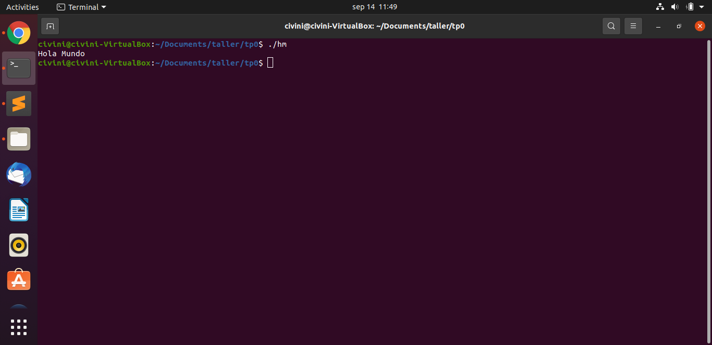
	 * 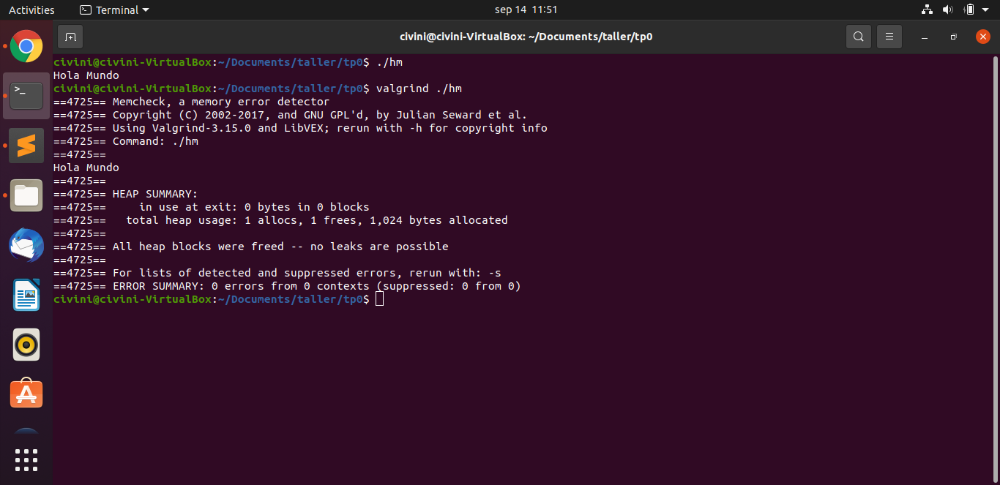
* Valgrind es una herramienta de debugging principalmente usada para encontrar fallas con el manejo de memoria de un programa. Estos pueden ser memoria que no se libera al finalizar el programa o que el programa intente de escribir en bloques de memoria ya liberados
* **sizeof()** en una función en el estandar de C y C++ la cual devuelve la cantidad de bytes que ocupa en memoria el tipo de dato que se le pase. Por ejemplo con un char que ocupa 8 bits **sizeof()** devolvería 1 y con un int devolvería 4.
* Al tener un struct que sea un conjunto de tipos de datos, su **sizeof()** no siempre va a corresponder a la suma de los **sizeof()** de sus tipos de datos, ya que puede que se haya agregado padding(boques de memoria vacia) al struct. Por ejemplo si hacemos

```c
struct es{
  char car;
  int num;
}
```
el char ocupa 1 byte mientras que el int ocupa 4. Al intentar guardar esto en una maquina de 32 bits se guardaría el char y los primeros 3 bytes del int en una dirección y el otro byte en otra. Por lo tanto dependiendo de la arquitectura y del compilador se pondran 3 bytes junto con el char para facilitar el acceso al int. Finalmente esto causará que el **sizeof()** del struct es sea 8.
 * STDIN, STDOUT y STDERR son archivos estandars que son usados para la comunicación entre programas. STDIN es el archivo el cual el programa lee para obtener información, STDOUT es el archivo sobre el cual el programa escribe su retorno y STDERR es donde se guardan los errores al momento de ejecución del programa. estos archivos pueden ser redirigidos a otros usando caracteres especiales en linux. "<" para STDIN, ">" para STDOUT  y "2>" para STDERR. y se puede duplicar el caracter < en cada uno para que no borre el estandar anterior. También existe el | (pipe) el cual se puede usar para asignar el STDOUT de un programa al STDIN del siguiente.
## Paso 1
 * 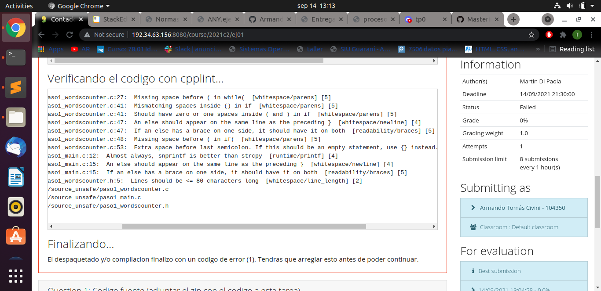
     Aqui se muestran los errores de estilo marcados por el cpplint al hacer la entrega. El error 1 y 6 se refieren a que luego de una estructura como if o while hay que colocar un espacio entre esta y el parentesis. El error 2 y 3 hablan de espacios innesesarios dentro de los parentesis. Los errores 4, 5 , 9 y 10 hablan de que los else tiene que estar en la misma linea que el bracket que cierran y el que abren. El error 7 menciona un espacio innesesario antes de un punto y coma. El error 8 es dice que es preferente usar casi siempre **snprintf()** sobre **strcpy()**. Finalmente el 11avo error es sobre una linea que contiene más de 80 caracteres, lo cual es incorrecto.
 * 
     Estos son los errores de generación que surguieron al entregar. Los 5 errores presentes son linker error, uno de ellos por no reconocer un tipo de dato que debería obtener de otro archivo y los otros 4 por no reconocer funciones que estan declaradas en otro archivo.
 * El sistema no reportó warnings ya que se compiló con el comando -Werror el cual transforma todas las warnings en errores.
## Paso 2
 * En cuanto a los cambios entre el paso 1 y el paso 2, en el archivo paso_main  se agregó el include del archivo "paso_wordcount.h" lo cual corrije los errores de linker del paso pasado, se cambió **strcpy()** por **memcpy()** y se puso a else en la misma linea que el corchete del if que lo antecede lo cual corrijieron sus respectivos errores en el cpplint. En el archivo "paso_wordscounter.c" solo se hicieron cambios sintacticos para corregir los errores cpplint. y finalmente en el archivo "paso_wordcounter.h" se acortó la linea mayor a 80 caracteres por un comentario más resumido.
 * 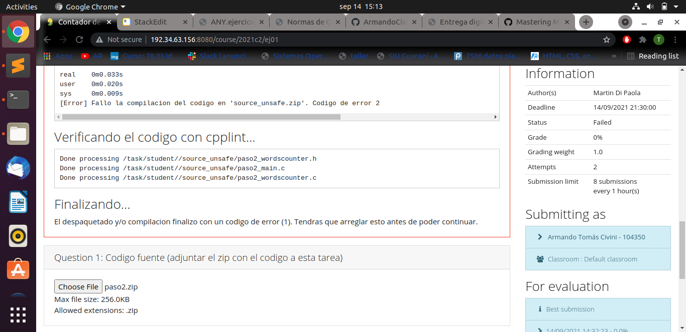
 * 
 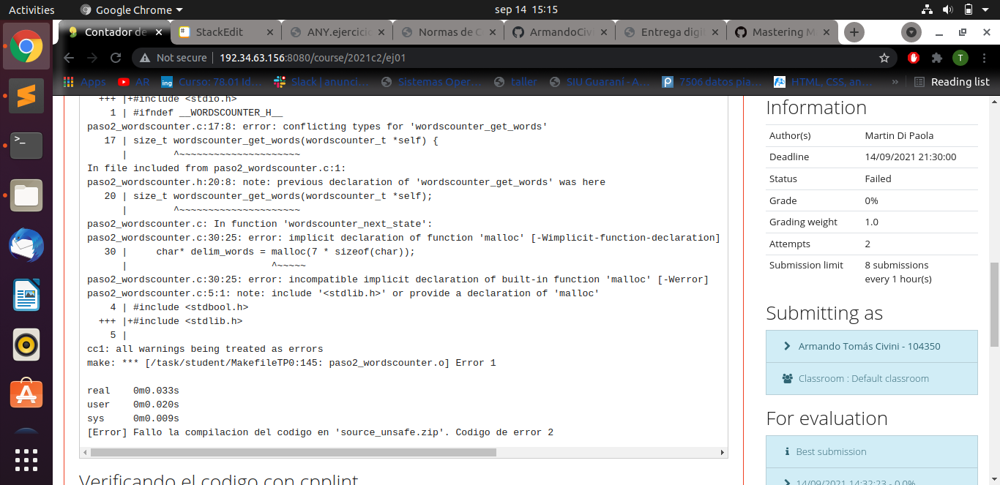
 En este paso los primeros dos errores se dan debido a que no se reconoce el tipo de dato size_t ya que no se agregó la dependencia adecuada que sería "stddef.h" asi que estos son errores de linkeo. De esta misma manera también falta la dependencia del tipo de dato FILE que se encuentra en "stdio.h" lo cual causa el siguiente error de linkeo. /El último error se debe a que se usó la función malloc sin incluirse la librería a la cual pertenece por lo cual es un error de linkeo.
 ## Paso 3
 
 * Para este paso no hay diferencias en el archivo "paso_main.c". En cuanto a "paso_wordcounter.c" se agregó la librería "stdlib.h" y en "paso_wordcounter.h" se agregaron las librerías "string.h" y "stdio.h".
 * 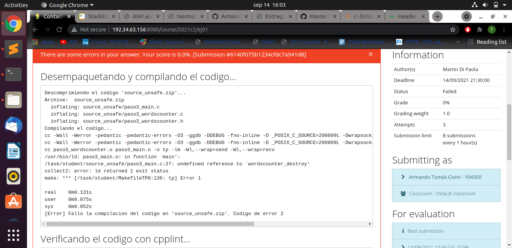
 En este paso vemos que el único error es la falta de la declaración de la función "wordcounter_destroy" ya que a pesar de estar declarada en el header file, esta no esta definida su funcionalidad en el "paso_wordcounter.c"
## Paso 4
 * El único cambio que hubo en este paso es la definición de la función "wordconter_destroy" en el archivo "paso_wordcounter.c"
 * 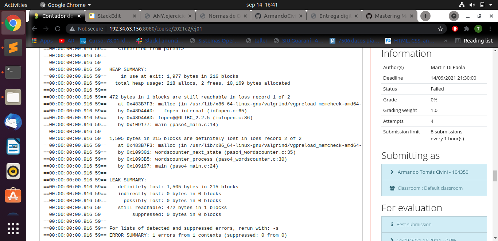
 Aqui valgrind nos indica que se fugó memoría en dos instancias del programa. Una con la memoria alocada para el archivo que abrimos desde "paso_main.c" y otro por el malloc que hacemos en la función"wordscounter_next_state".
 * 
 El error reportado en este caso es un **buffer overflow**. Este fenómeno ocurre cuando sobre un bloque de memoria, más información de la que entra en este asi corriendo el riesgo de sobreescribir otros datos. En este caso sucedió al intentar de usar una cadena muy larga en la función **memcpy()**
 * **strncpy()** no hubiera evitado este error ya que esta también tiene una capacidad maxima que puede manejar
 * **Segmentation fault** es un error que ocurre cuando un programa intenta acceder a memoria que no le fue otorgada por el sistema operativo. Buffer overflow se explica en el punto anterior.
 ## Paso 5
 
 * En este paso, en el archivo "paso_main.c" se puso directamente el argumento para abrir el archivo y tmb se agregó codigo para cerrarlo. Tambien para "paso_wordcounter.c" se quitó el malloc y se remplazó por una variable.
 * 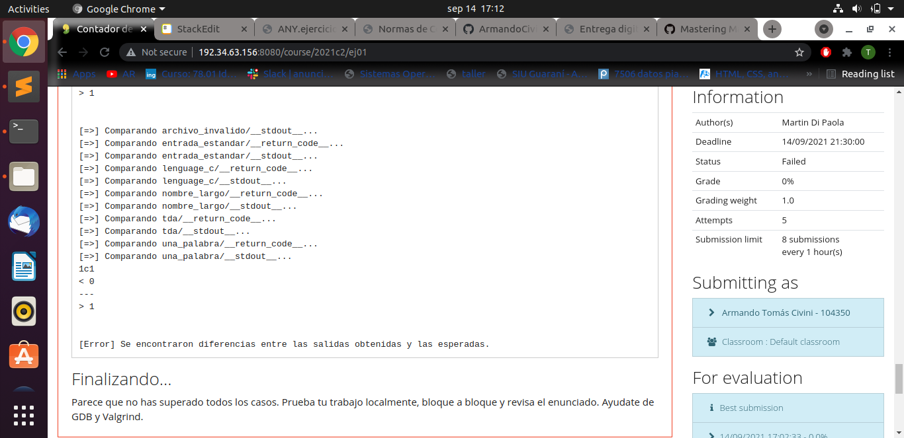
 Aqui vemos que esta prueba falla ya que da 0 en vez de 1. Esto es porque el contador de palabras empieza en 0 y al haber una sola palabra no hay ningun delimitador por lo que se mantiene en 0.
 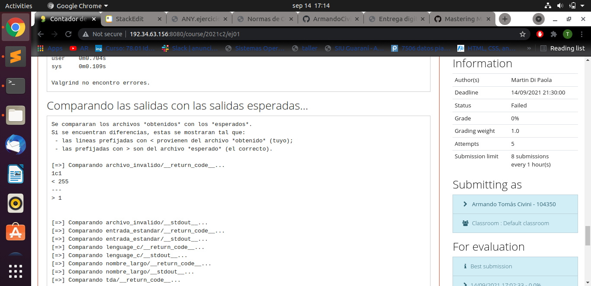
 En este caso el resultado da 255 en vez de 1 por el hecho que el codigo no tiene en cuenta casos como archivos invalidos por lo que resulta en comportamiento no deseado
 * El último caracter del "input_single_word.txt" es el **End of Transmit**
 * 
Aqui vemos la ejecución con gdb del programa. En cuanto a los comandos, info function nos da una lista de las funciones definidas, list imprime las lineas de la funcion que le pasamos, break más una cantidad hace un break esa cantidad de lineas después, el commando run empieza a correr el programa nuevamente y finalmente quit cierra el gdb. El break no ocurrio ya que nunca llegamos a esa instancia en el programa.
## Paso 6
 * En esta ultima instancia, en el archivo "paso_main.c" se definió el error como 1 en vez de -1 y en "paso_wordcounter.c" ahora se cuenta el end of file como palabra.
 * 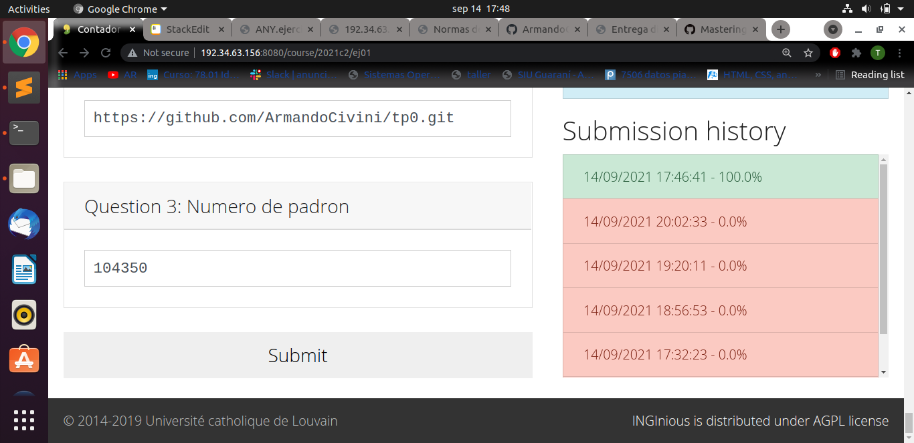
 * 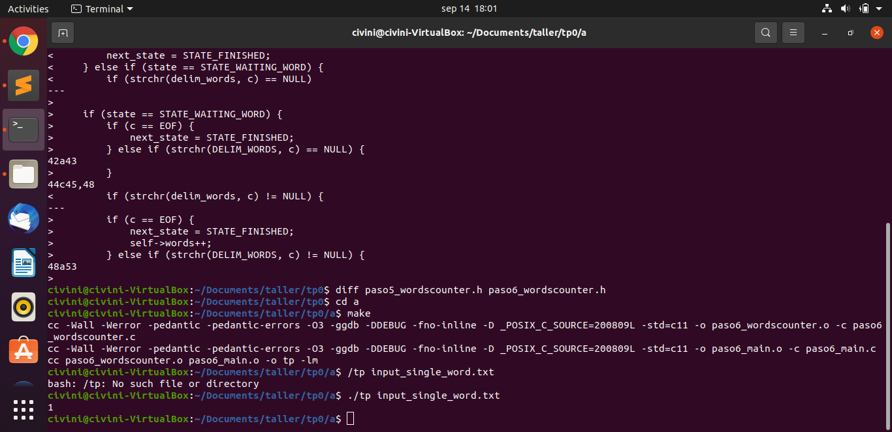
 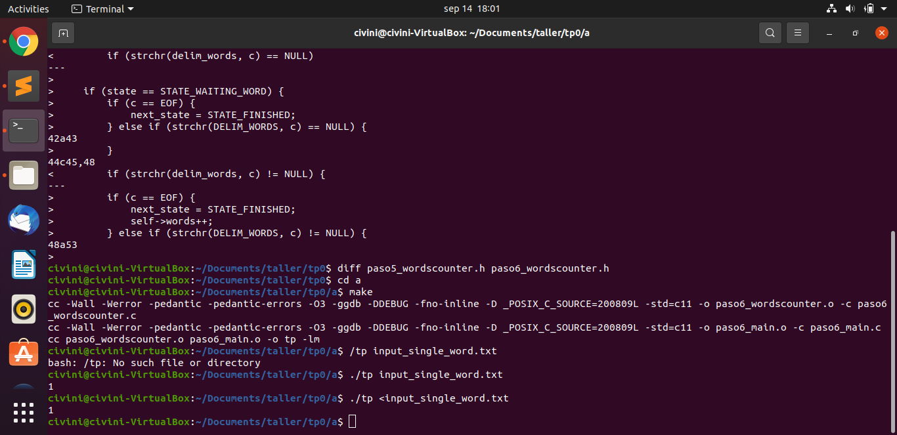
 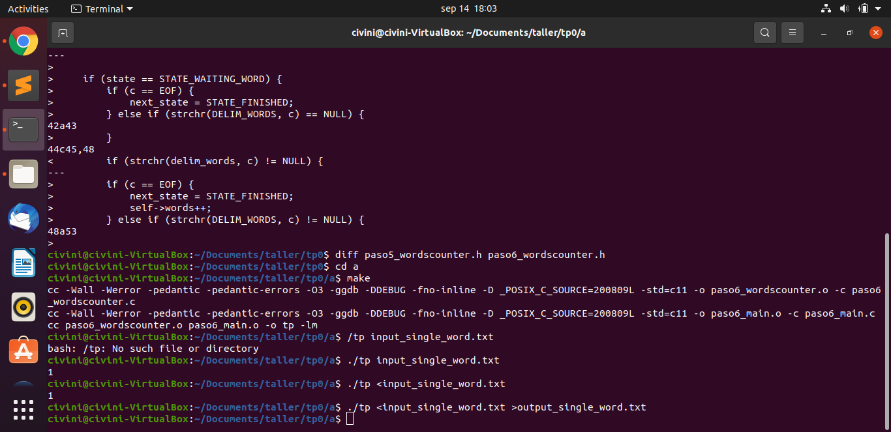

## Paso 8

 * Para nc el comando -l sirve para ponerlo en modo de escucha de conexiones y el comando -p es para especificar el port
 * 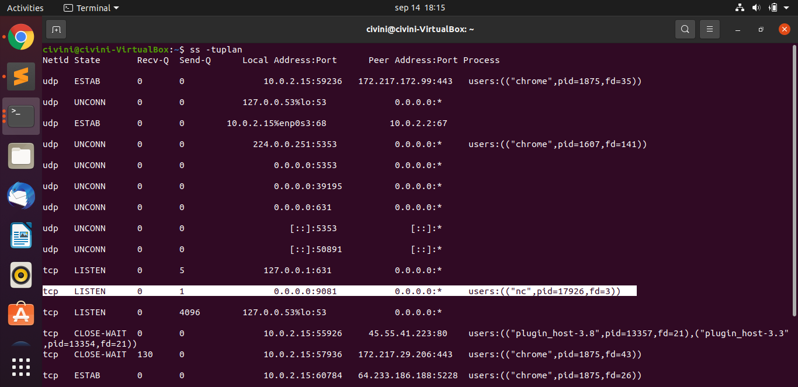
 * En la primera consola se ve lo que se escribe en la tercera
 * 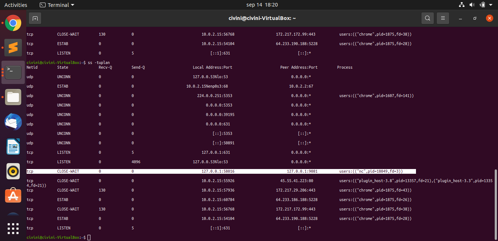
 * Al correr este tipo de conexion con tiburoncin podemos ver y analizar los bits enviados entre ambos puntos. Junto con hexdump podemos interpretar los mensajes entre estos puntos. Tiburoncin funciona como un man in the middle ya que intercepta la conexion y atrapa todos los mensajes entre ambos puntos.
 * 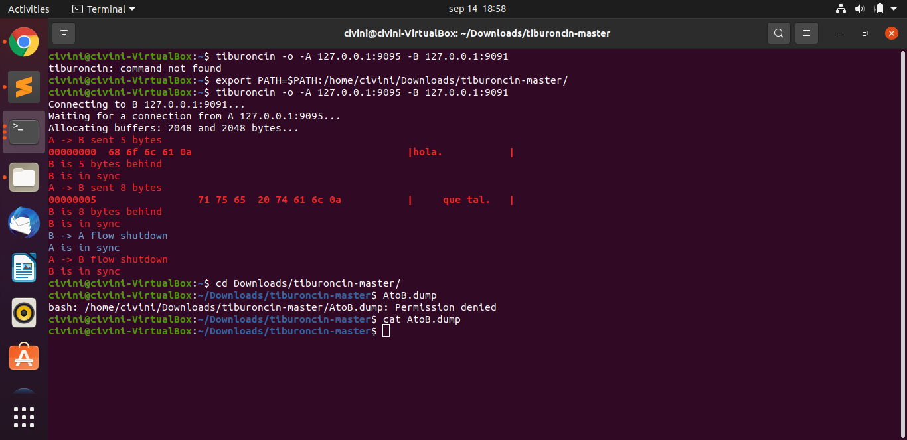
 * 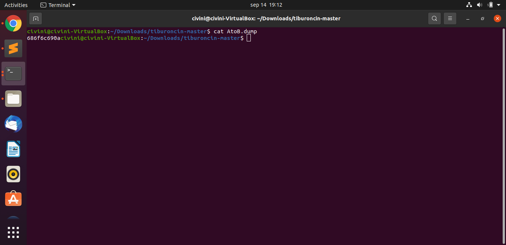
 * 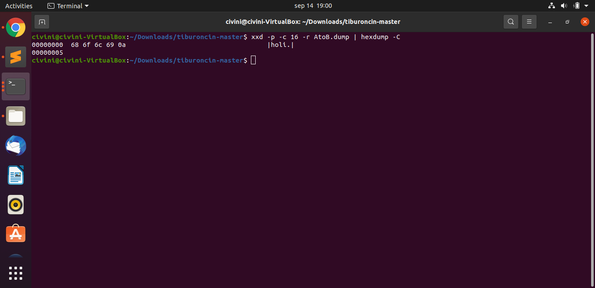
